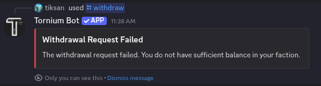
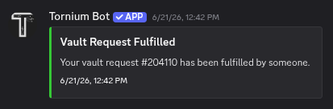
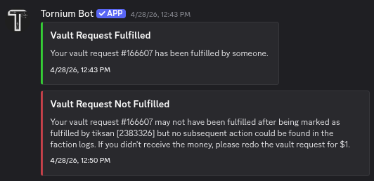
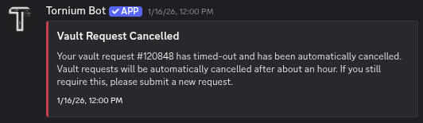
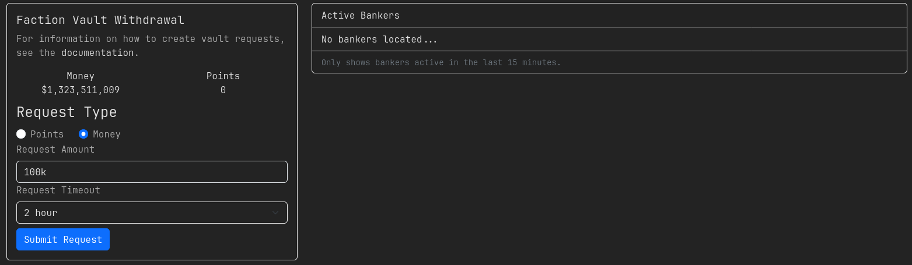

# How to make a vault request?
This guide shows you how to make a vault request through Tornium against your faction vault balance. This requires that your faction has set up Tornium for banking already. You can do this through either the [Tornium Discord bot](#discord-bot) or through [Tornium's website](#website).

## Discord Bot
Use `/withdraw` slash command in any Discord channel with the bot or in a DM with the bot. You will need to enter how much money you want to withdraw; this can be `all` for everything or shortened numbers such as `100k` or `10m` in addition to full numbers. Here, you can also optionally set if you want to withdraw points instead of money and how long the vault request should be active before timing out. You should set this to a reasonably short period so you don't get sent the money while you're offline and get mugged; by default, the vault request will time out in one hour.

This will also check if you have insufficient balance in your faction vault for the request, in which case the bot will inform you of such:

If the withdrawal request has successfully been sent to your faction's bankers, you will receive a message indicating that:

Once a banker sees your vault request, fulfills it, and send you your money/points in-game, the bot will send you a message:

However, sometimes the vault request will either time out because there aren't bankers online or the vault request will be marked as fulfilled but nothing was sent to you. This will result in the following messages. You should resend the vault requests in this case if you still need the money/points.

Before the vault request has been fulfilled, you can cancel your most recent request with the `/cancel` slash command in any Discord channel or in an DM with the bot:

## Website
You can use the [banking page](https://tornium.com/faction/banking) on the Tornium website, after signing into Tornium with an API key or through Discord, to withdraw money or points from your faction vault balance. You will need to choose if you are withdrawing money or point and how much you want to withdraw; the amount can be `all` for everything or shortened numbers such as `100k` or `10m` in addition to full numbers. You can also choose how long the vault request shuld be active before timing out. You should set this to a reasonably short period so you don't get sent the money while you're offline and get mugged; by default, the vault request will time out in one hour.

Notifications about your vault request will be sent to your Discord DMs by the Discord bot if you have previously linked your Discord account on Torn's Discord server.

Once a banker sees your vault request, fulfills it, and send you your money/points in-game, the bot will send you a message:

However, sometimes the vault request will either time out because there aren't bankers online or the vault request will be marked as fulfilled but nothing was sent to you. This will result in the following messages. You should resend the vault requests in this case if you still need the money/points.

