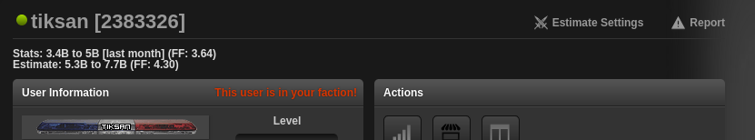
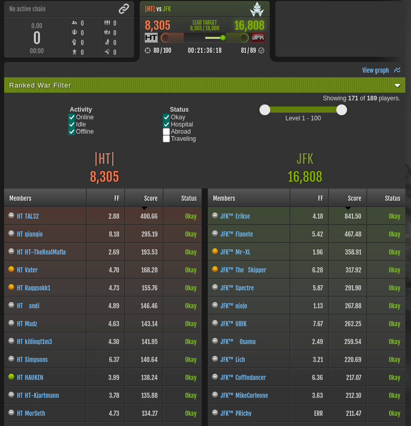
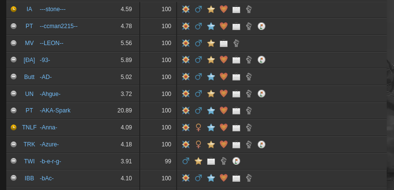
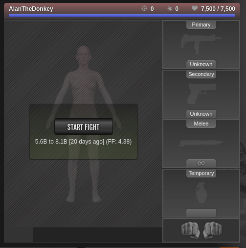
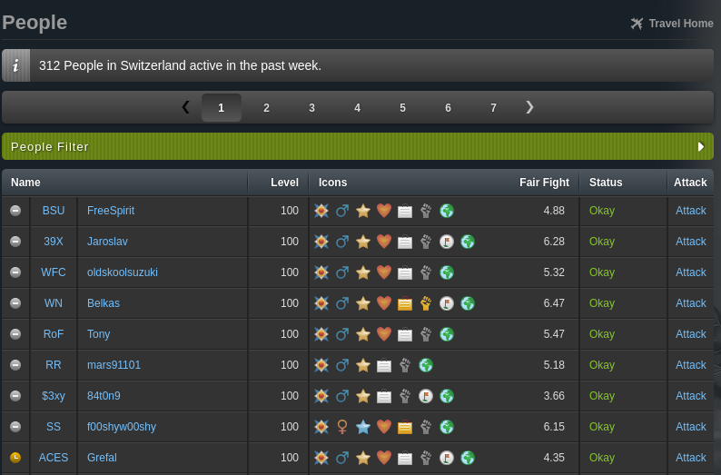

# Tornium Estimate
The Tornium estimate userscript shows users' stats in-game according to the [historical stat database](https://tornium.com/stats/db) or statistically-modeled stat estimations. For information on installing the userscript, see the [tutorial](../tutorial/tornium-estimate.md).

**NOTE:** For features that only show fair fight due to space limitations, the userscript will prefer using the stat DB unless the data from the stat DB is over a month old. If the data is too old, the userscript will use a stat estimation instead. 

## How does it work?
Depending on the page, the userscript will make an API call to Tornium’s servers to retrieve an estimate of the user’s stats or to retrieve the users stats from its database. An uncapped fair fight score will also be generated from your stats the last time you’ve visited the gym page. Being uncapped, this allows you to quickly see the relative strength of the target with 3x FF being about 50-75% of your stats.

## Support Pages
Currently, the userscript supports the following in-game pages:
- [Profile](#profile)
- [Faction RW](#faction-rw)
- [Advanced Search](#advanced-search)
- [Attack Loader](#attack-loader)
- [Abroad Users](#abroad-people)

### Profile
On both your and other users' profiles, the userscript will show both the last accessible stat for the user according the stat DB and the user's stat estimate. Additionally, here you can access userscript's settings by pressing the `Estimate Settings` button.

### Faction RW
On both your faction's RW page and other faction's RW pages, the userscript will show the fair fight the target should give you in the column the target's level is normally in. 

### Advanced Search
For in-game donators/subscribers, you can use the advanced search to filter and search through users. The userscript will show the fair fight the target should give you next to the target's name.

**NOTE:** It is suggested to disable `Honor Names` in [Torn's settings](https://www.torn.com/preferences.php) as the fair fight may be unreadable on certain honor bars.

### Attack Loader
On attack loaders, Tornium will show the user's stats from the stat DB or stat estimate underneath the `Start Fight` button.

### Abroad People
When abroad in a different country, Tornium will show the fair fights of the users next to the targets' icons.

