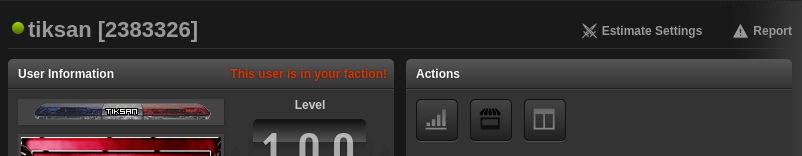
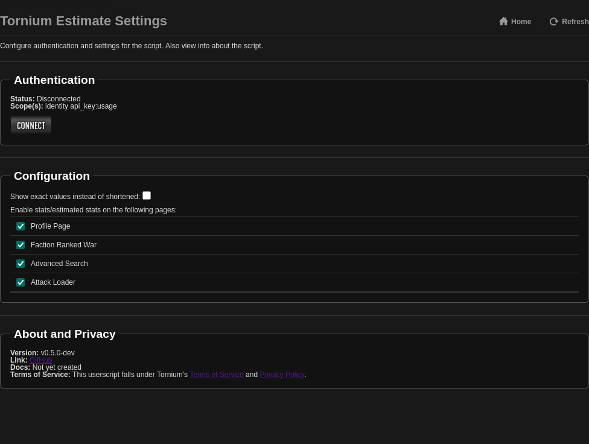

# Install Tornium Estimate Userscript
In this tutorial, we will be installing and setting up the Tornium stat estimation userscript. This userscript will show users' stats according to the [historical stat database](https://tornium.com/stats/db) or the statically-modeled stat estimates.

Before starting, ensure you have a userscript manager installed on your browser. The recommended and tested userscript managers are the following:
- [Tampermonkey](https://www.tampermonkey.net/) - Chrome, Firefox, Edge, Opera, Safari, etc.
- [Violentmonkey](https://violentmonkey.github.io/) - Chrome, Firefox, Edge, etc

**NOTE:** TornPDA may work for you on the built-in userscript manager, but some people will have issues with TPDA injecting the userscript due to a bug with TPDA. Due to this and the lack of development tooling to debug issues on TPDA, support for TPDA is as-is. I will try to keep it running, but I can only say that it only works for me on my phone.

Once the userscript manager has been installed, on the browser with the userscript manager, navigate to the [userscript](https://github.com/Tornium/tornium/blob/master/userscripts/tornium-estimate.user.js) and press the `Raw` button (or visit [this link](https://github.com/Tornium/tornium/raw/refs/heads/master/userscripts/tornium-estimate.user.js)). If your userscript manager is installed properly, this will automatically install the userscript and show a confirmation page from the userscript manager. If you’re installing the userscript onto TornPDA, make sure that the injection time is set to the end.

You can ensure the userscript has been installed by visiting any user's profile page and pressing the `Estimate Settings` button (see the below image). If you are on a mobile device, the label on the button will be hidden by Torn and only the icon on the image will be shown.

By pressing that button, you will be taken the page to configure this userscript (similar to the below image).

You will need to press the `Connect` button to authenticate with Tornium. This will redirect you to Tornium where you can either sign in with an API key or through Discord (which doesn't require an API key but does require you to have linked Torn and Discord accounts). After signing into Tornium, you can authorize the userscript to make API calls against your Tornium user.

Once authorized, you will be redirected back to Torn. If the userscript has successfully authenticated with Tornium, the authentication status in the userscript's settings will say `Connected`.

**WARNING**: Due to security limitations of userscripts and userscript managers, in an attempt to keep your Tornium account secure, you MUST re-authenticate every week. This can be done in the userscript's settings.

For more information on this userscript, see the [Tornium estimate reference](page).
